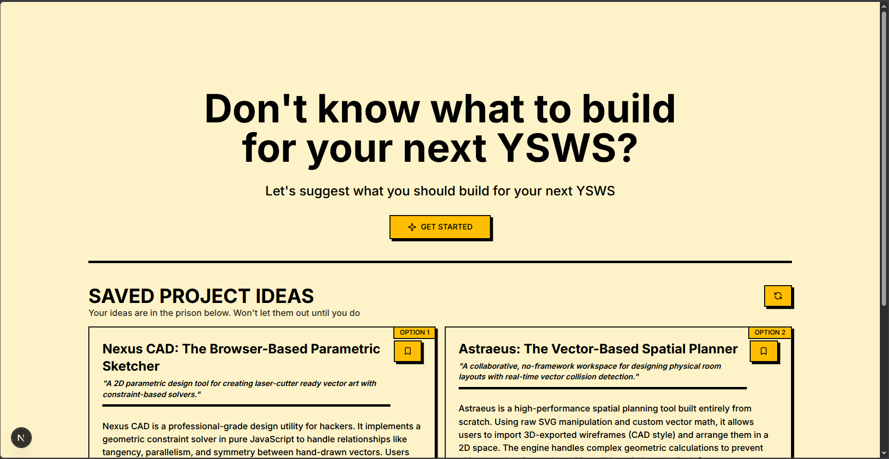

# YSWS PROJECT IDEA GENERATOR

This is website that allow you to generate project ideas for your next YSWS project. If you don't know what to build next, you definitely need this.



## Features

This project come with this features

- Step by step quiz-like form to get details for the kind of idea you want to build.
- Get up to three ideas based on the theme you want
- Saved ideas that stand out to you
- Remove ideas when you don't need them
- A gamified UI designed specifically for Hack clubbers

## Theme

This project uses Neobrutalism Design

[Check here for more Details](https://www.neobrutalism.dev/)

## Tech Stack Used

- NextJS
- ReactJS
- Shadcn Design System (Neobrutalism)
- TailwindCSS

## Contribute to this project

Help make this project better for Hack clubbers.

Feel Free to raise an issue or create a PR.

### Environment Variable

For the environment variables a sample is projected at `.env.example`, any new environment variable must be added to this file for other to know.

### Usage

To run this project on your computer, follow those steps

1. Clone this repo

   ```bash
   git clone https://github.com/mumuniazeez/ysws-project-idea-generator.git

   cd ysws-project-idea-generator
   ```

2. Install all the dependencies

   ```bash
   pnpm install
   ```

   Feel free to use any package manager of your choice

3. Run the project

   ```bash
   pnpm dev
   ```

## License

MIT

## AI Disclosure

AI wasn't used in any part of the project. All code and UI was completely written and design by me.
